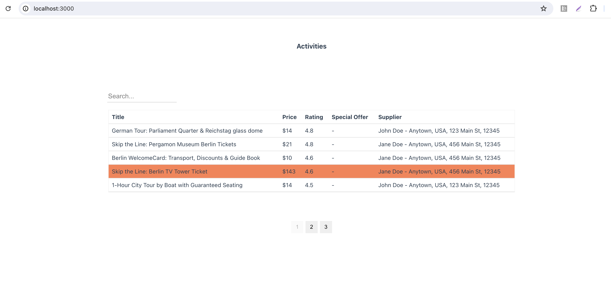

# Example application

The service is using the GraphQL API so that the client application could decide which data is needed and also
add the option to request the offset, number of items per page, search query by the activity title.
With such approach it is fairly easy to request the data from the client application without the need to load huge chunks of
data and do the filtering on the FE part.

- The assumption also is that the amount of items could be large and we should have the pagination (infinite scrolling) on the client
- To start the app, go into the root folder and: `docker compose up --build`
- Start instructions per service are located in the corresponding folder
- TypeScript language is used both on the BE/FE


## BE
- Built on the top of the NestJS framework: https://nestjs.com/
- Exposes GraphQL API where the client application can request the needed properties, pagination and do search by title
- In-memory cache example added to get the suppliers items in order to reduce the Supplier search, TTL=2hr
- Exceptions handler added
- Simple logger example added
- An abstract repository type created so that the specific repository implementation could follow the contract
- Static files repository created to read the information about the Activities/Suppliers from the file
- Abstract DataService type is created to set up the service contract
- DataService implementation added
- Models are created for internal use with copy constructors and simple validation
- Entities created for building GraphQL schemas (code first approach)
- The API is exposed on the following link: `http://localhost:8080/graphql`
- The example query is:
```
query ActivitiesList {
    activitiesList(limit: 50, offset: 0, search: "") {
    totalCount
    offset
    activities {
      id
      title
      price
      currency
      rating
      supplier {
        name
        address
        zip
        country
      }
    }
  }
}
```


## FE
- The FE part is done with React lib, I need to refresh the knowledge on Vue3 so that I could quickly can create the with latest updates
- Apollo client is used to query the needed data
- Search by title option is added
- A simple pagination is added, the limit of items per page is 5, a user can navigate between the pages, on search the default page is 1
- The simple table approach is added to render the items, the columns of the table are coming from the static config, the rows are mapped
by the config keys, the row items must be mapped before providing to a table
- The FE app is running at: `http://localhost:3000/`


## To be updated:
- Add contract tests, e2e for FE app, Playwright etc.
- Think about proper caching strategies or update the mapping logic so that it takes constant time
- Update the DataService to use DI (dependency injection) for specific Repository, no onApplicationBootstrap approach,
this way we remove thightly coupled Repository creation and can inject any Repository provider whenever DataService is used
- Add proper monitoring tools
- Enable proper security
- Create proper production build pipeline
- Add the internalisation on the FE so that the specific translation is rendered based on the translation key
- Add exceptions handling/monitoring tools on the FE side (Sentry, DataDog, etc.)
- If required, the application can be build with SSR so that the content is delivered faster for the first contentful paint

  
